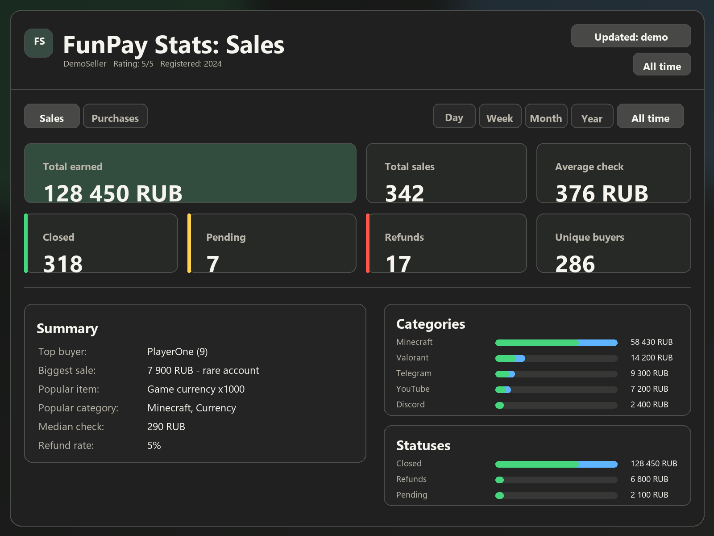
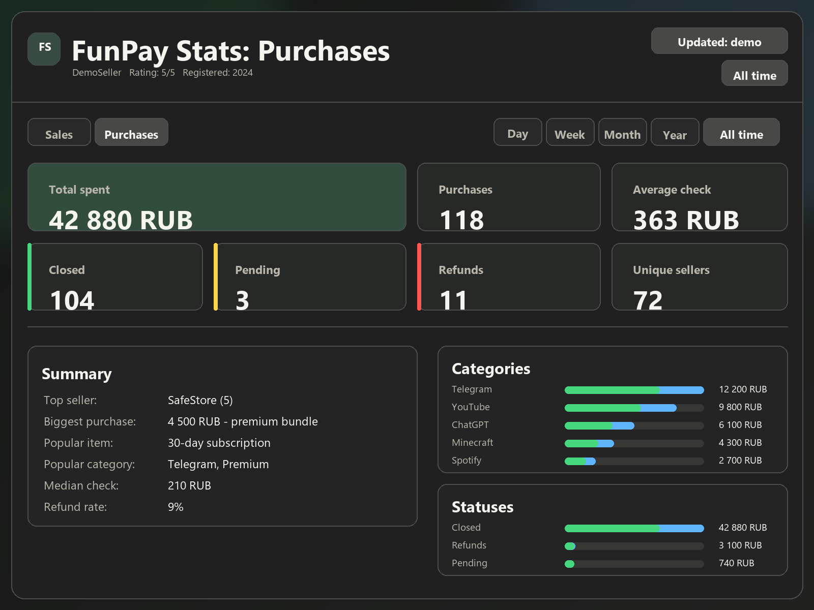

# FunPay Stats Dashboard

Красивый локальный HTML-дашборд для статистики FunPay: продажи, покупки, периоды, статусы, средний чек, возвраты, популярные товары и категории.





## Возможности

- Переключение периодов: день, неделя, месяц, год, все время.
- Две вкладки: продажи и покупки.
- Метрики: заработал/потратил, всего заказов, средний и медианный чек.
- Статусы: закрыто, в ожидании, возвраты.
- Уникальные покупатели/продавцы.
- Итоги: самый активный покупатель/продавец, дорогая продажа/покупка, популярный товар и категория.
- Локальный HTML-отчет без внешнего backend.

## Установка

```powershell
pip install -r requirements.txt
```

## Быстрый запуск без входа

```powershell
python funpay_stats.py --profile 2600949 --open
```

Этот режим берет только публичные данные профиля: офферы, рейтинг и отзывы. Скрипт догружает дополнительные страницы отзывов через публичный endpoint. Покупки, уникальные покупатели/продавцы, возвраты и точные периоды FunPay публично не показывает.

## Точная статистика продаж и покупок

Нужен cookie `golden_key` из авторизованного браузера FunPay (F12 - Application - Cookies - golden_key:

```powershell
$env:FUNPAY_GOLDEN_KEY="сюда_значение_golden_key"
python funpay_stats.py --profile 2600949 --period year --open
```

Можно использовать `.env.example` как шаблон для локального `.env`, но сам `.env` не публикуй.

Передавать `golden_key` через переменную окружения безопаснее, чем писать его прямо в команду: команды могут попасть в историю терминала.

Можно также передать cookie напрямую, но для публичного или чужого компьютера так лучше не делать:

```powershell
python funpay_stats.py --profile 2600949 --golden-key "сюда_значение_golden_key" --open
```

HTML сохранится в `funpay_stats.html`. Внутри страницы можно переключать `Продажи / Покупки` и периоды без повторного запуска.

## Безопасность перед публикацией

Не публикуй `golden_key`, полную строку `Cookie` и сгенерированные HTML-отчеты. Готовый `funpay_stats.html` может содержать приватную статистику: суммы, ники покупателей/продавцов, названия товаров и категории. Эти файлы добавлены в `.gitignore`, но перед релизом все равно проверь список файлов.

Скрипт не отправляет данные на сторонние серверы. Сетевые запросы идут к `funpay.com` для загрузки профиля, продаж и покупок. Готовый HTML работает локально, но может подгружать аватар с CDN FunPay.

## Полезные параметры

```powershell
python funpay_stats.py --help
```

- `--period day|week|month|year|all` - период, который будет выбран в HTML по умолчанию.
- `--max-pages 30` - максимум страниц заказов для загрузки для каждого направления.
- `--max-review-pages 15` - максимум дополнительных страниц публичных отзывов.
- `--sales-html sales.html` - разобрать сохраненную страницу продаж `/orders/trade`.
- `--purchases-html purchases.html` - разобрать сохраненную страницу покупок `/orders/`.
- `--orders-html orders.html` - старый алиас для `--sales-html`.
- `--profile-html profile.html` - разобрать сохраненную страницу профиля.
- `--output result.html` - имя итогового HTML.
